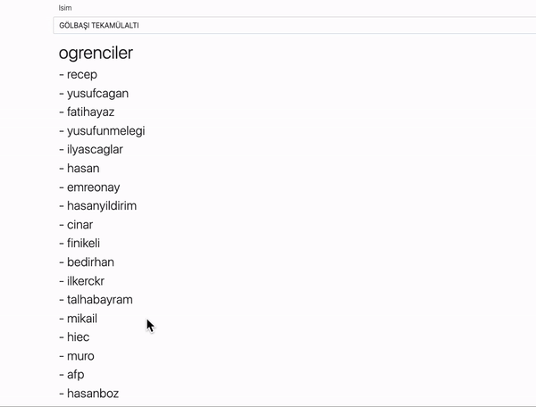
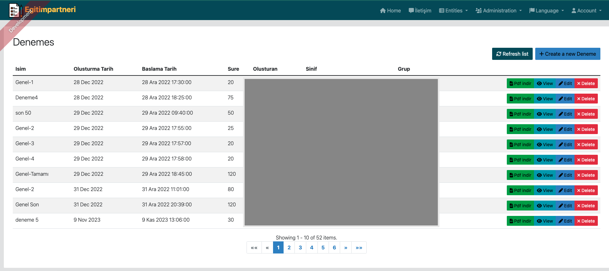
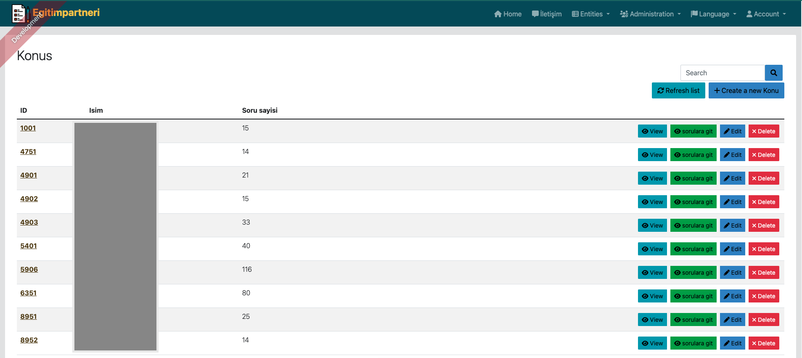

# Temrin Matik: Öğrencilere Yön Veren Eğitim Platformu

Temrin Matik, öğrencilerin deneme çözebileceği ve ders çalışabileceği interaktif bir eğitim platformudur. Eğitim sürecini daha etkili ve keyifli hale getirmeyi amaçlayan bu platform, öğrencilere özel tasarlanmış bir deneyim sunar. Editörler tarafından eklenen zengin içerikleriyle öğrenciler, konuları daha iyi anlamalarına yardımcı olan soruları çözebilir ve performanslarını geliştirebilirler.

## Projenin Temel Amacı

Temrin Matik, eğitim sürecini destekleyen bir dizi özellik sunarak öğrencilere rehberlik etmeyi hedefler. Platform, öğrencilerin deneme çözme pratiği yapmalarını sağlar ve bu süreçte öğrenmelerini artıracak zengin içeriklere erişim imkanı tanır. Aynı zamanda öğretmenler için de bir ara yüz sunarak, öğrenci performanslarını izleme ve değerlendirme imkanı sağlar.

## Projenin Teknik Altyapısı

Temrin Matik'in güçlü teknik altyapısı, projenin istikrarlı bir şekilde çalışmasını sağlar. Backend tarafında Java Spring Boot kullanılarak güçlü ve ölçeklenebilir bir sistem oluşturulurken, veritabanı olarak PostgreSQL tercih edilmiştir. Frontend kısmında Angular kullanılarak kullanıcı dostu ve etkileşimli bir arayüz tasarlanmıştır. Projenin yayınlanması ve hostingi için Heroku tercih edilirken, dosya depolama için AWS S3 kullanılmaktadır.

## Projeyi Başlatma Adımları

Projeyi başlatmak için aşağıdaki adımları takip edebilirsiniz:
1. Veritabanı bilgilerini güncelleyin.
2. E-posta bilgilerini güncelleyin.
3. AWS S3 bilgilerini güncelleyin.

Bu adımları takip ederek, Temrin Matik'i sorunsuz bir şekilde başlatabilir ve öğrencilerinize interaktif bir eğitim deneyimi sunabilirsiniz.

# Database Şeması

*Projenin Veritabanı Şeması*

# Kullanıcı Rollerine Özel Özellikler

## Giriş Sayfası
Uygulamanın ana giriş sayfası, kullanıcılarına hızlı ve kolay bir şekilde sisteme erişim sağlar.

*Giriş Sayfası ve Kayıt Olma Ekranı*

*Login Sayfası*

*Kayıt Olma Ekranı*

*Şifremi Unuttum Ekranı*

*İletişim Sayfası*

## Öğrenci Özellikleri
Öğrenciler, denemeleri çözebilir, performanslarını takip edebilir ve öğrenim materyallerine erişim sağlayabilir.

*Kullanıcı Ayarları*

*Sınıf Yoksa Ekran*

*Sınıf Kodu Girilir Ekranı*

*Sınıf Gelir Ekranı*

*Denemeler Sayfası*

*Deneme Giriş Ekranı*

*Deneme Çıkış Ekranı*

*Girilen Deneme Analiz Ekranı*

*Deneme Analiz Sayfası*

*Ders Çalışma Boş Ekran*

*Ders Çalışma Ders Seçili Ekran*

*Ders Çalışma Soruları Ekranı*

## Öğretmen Özellikleri
Öğretmenler, sorular ekleyebilir, öğrenci performanslarını değerlendirebilir ve öğrencilere özel geri bildirimler sağlayabilir.

*Sınıf Ekranı*

*Sınıf Öğrenci Görüntüleme Ekranı*

*Oluşturulan Denemeler Ekranı*

*Deneme Oluşturma Ekranı*

*Deneme Analiz Ekranı*

## Admin Özellikleri
Admin kullanıcıları, platformun genel yönetimini sağlar, kullanıcı hesaplarını yönetir ve sistemin genel performansını takip eder.

*Kullanıcı Listesi Ekranı*

*Dönem Liste Ekranı*

*Admin Menü Ekranı*

*Yurtlar Listesi Ekranı*

*Yurt Oluşturma Ekranı*

*Sınıflar Listesi Ekranı*

*Sınıf Oluşturma Ekranı*

*Mesajlar Sayfası Ekranı*

*Denemeler Listesi Ekranı*

*Denemeler PDF Oluşturma Ekranı*

*Deneme Analizleri Listesi Ekranı*

*Öğrenci Deneme Analiz Ekranı*

*Gruplar Listesi Ekranı*

*Konular Listesi Ekranı*

*Konu Sorular Listesi Ekranı*

*Sorular Listesi Ekranı*

*Toplu Soru Ekleme Ekranı*

Temrin Matik, öğrencilerinizi destekleyen ve eğitim sürecini daha etkili hale getiren bir çözüm sunar.
